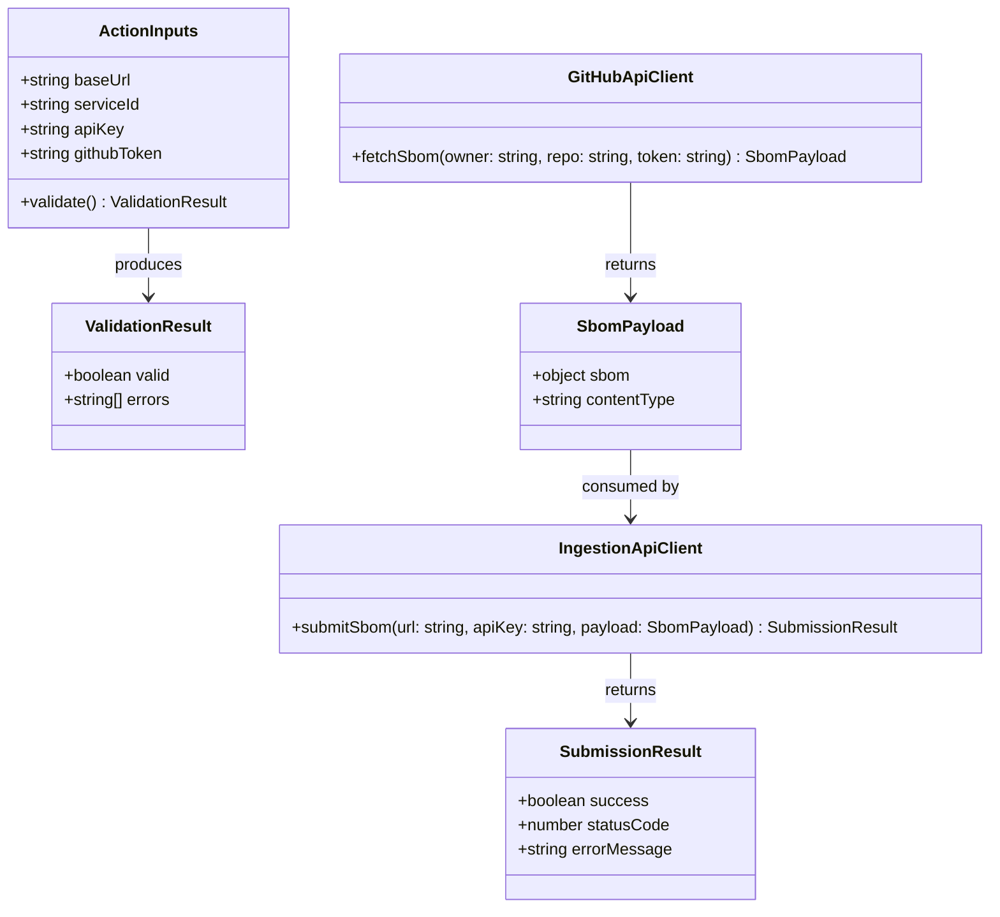

# SBOM Submission GitHub Action

## Requirements

Implement a TypeScript GitHub Action that retrieves a repository's Software Bill of Materials (SBOM) from the GitHub Dependency Graph API and submits it to our observability platform's ingestion API. The action must:

- Accept configurable inputs: base URL, service ID (UUID), and API key
- Construct the submission URL as `{base-url}/api/modules/sbom/services/{service-id}`
- Authenticate via `X-API-Key` header with content type `application/spdx+json`
- Validate all inputs before any network activity
- Never expose the API key in logs
- Report success/failure as the action outcome
- Fail gracefully with clear error messages for all failure modes

Primary use case: release workflows submitting SBOMs automatically after dependency changes.

## Entities



## Approach

1. **Input Validation (fail-fast)**:
   - Validate api-key presence (non-empty)
   - Validate base-url is a well-formed URL with scheme (https)
   - Validate service-id matches UUID v4 format
   - Register api-key as secret via `core.setSecret()` immediately
   - Abort with specific error messages before any network calls

2. **SBOM Retrieval**:
   - Use `@actions/github` Octokit instance (authenticated via GITHUB_TOKEN)
   - Call `GET /repos/{owner}/{repo}/dependency-graph/sbom`
   - Handle 403 (permissions), 404 (dependency graph not enabled), and 5xx (transient) distinctly
   - Extract SBOM JSON payload from response

3. **SBOM Submission**:
   - Construct target URL: `{baseUrl}/api/modules/sbom/services/{serviceId}`
   - POST using `@actions/http-client` with headers:
     - `X-API-Key: {apiKey}`
     - `Content-Type: application/spdx+json`
   - Handle response: 2xx = success, 4xx/5xx = failure with status and sanitized error body
   - Sanitize any response body before logging (strip potential key echoes)

4. **Reporting**:
   - On success: set action as passed, write job summary
   - On failure: call `core.setFailed()` with descriptive message including HTTP status where applicable
   - Never include api-key value in any output

## Structure

### Dependencies
1. `@actions/core` — input reading, secret masking, failure reporting, summary
2. `@actions/github` — authenticated Octokit for GitHub API calls
3. `@actions/http-client` — HTTP POST to ingestion API

### Module Layout
```
├── action.yml              # Action metadata (inputs, outputs, runs)
├── src/
│   ├── main.ts            # Entry point — orchestrates validate → fetch → submit
│   ├── validate.ts        # Input validation logic
│   ├── github-api.ts      # SBOM retrieval from GitHub API
│   ├── ingestion-api.ts   # SBOM submission to ingestion endpoint
│   └── types.ts           # Shared type definitions
├── dist/
│   └── index.js           # Compiled + bundled output (ncc)
├── tsconfig.json
├── package.json
└── package-lock.json
```

### Data Flow
```
action.yml inputs → main.ts → validate.ts (fail-fast)
                            → github-api.ts (fetch SBOM)
                            → ingestion-api.ts (POST SBOM)
                            → core.setFailed() or core.summary
```

## Operations

### Create action.yml - Action Metadata
1. Responsibility: Define the action interface for consumers
2. Configuration:
   - `name`: "Submit SBOM to Observability Platform"
   - `description`: "Retrieves repository SBOM from GitHub and submits to ingestion API"
   - `inputs`:
     - `base-url`: required, description "Base URL of the ingestion API (e.g. https://api.example.com)"
     - `service-id`: required, description "UUID of the target service in the observability platform"
     - `api-key`: required, description "API key for ingestion API authentication"
     - `github-token`: not required, default `${{ github.token }}`, description "GitHub token for dependency graph API access"
   - `runs`:
     - `using`: "node20"
     - `main`: "dist/index.js"

### Create src/types.ts - Type Definitions
1. Responsibility: Shared interfaces for the action
2. Types:
   - `ActionInputs`: `{ baseUrl: string; serviceId: string; apiKey: string; githubToken: string }`
   - `ValidationResult`: `{ valid: boolean; errors: string[] }`
   - `SbomResponse`: `{ sbom: unknown }` (opaque JSON passthrough)
   - `SubmissionResult`: `{ success: boolean; statusCode: number; errorMessage?: string }`

### Create src/validate.ts - Input Validation
1. Responsibility: Validate all inputs before any network activity
2. Methods:
   - `validateInputs(inputs: ActionInputs): ValidationResult`
     - Logic:
       - Check `apiKey` is non-empty string
       - Check `baseUrl` parses as valid URL with `https:` or `http:` scheme
       - Check `serviceId` matches UUID regex `/^[0-9a-f]{8}-[0-9a-f]{4}-[0-9a-f]{4}-[0-9a-f]{4}-[0-9a-f]{12}$/i`
       - Check `githubToken` is non-empty
       - Collect all errors (do not short-circuit — report all at once)
     - Return: `{ valid: true, errors: [] }` or `{ valid: false, errors: [...] }`

### Create src/github-api.ts - SBOM Retrieval
1. Responsibility: Fetch SBOM from GitHub Dependency Graph API
2. Methods:
   - `fetchSbom(token: string, owner: string, repo: string): Promise<SbomResponse>`
     - Logic:
       - Create Octokit instance with token
       - Call `octokit.request('GET /repos/{owner}/{repo}/dependency-graph/sbom')`
       - On success: return `{ sbom: response.data }`
       - On 403: throw with message "Insufficient permissions — ensure GITHUB_TOKEN has `contents: read` and dependency graph is enabled"
       - On 404: throw with message "Dependency graph not available — ensure it is enabled in repository settings"
       - On other errors: throw with message including HTTP status code

### Create src/ingestion-api.ts - SBOM Submission
1. Responsibility: POST SBOM to ingestion endpoint
2. Methods:
   - `submitSbom(baseUrl: string, serviceId: string, apiKey: string, sbom: unknown): Promise<SubmissionResult>`
     - Logic:
       - Construct URL: `${baseUrl}/api/modules/sbom/services/${serviceId}`
       - Create `HttpClient` from `@actions/http-client`
       - POST with headers: `{ 'X-API-Key': apiKey, 'Content-Type': 'application/spdx+json' }`
       - Body: `JSON.stringify(sbom)`
       - On 2xx: return `{ success: true, statusCode: response.message.statusCode }`
       - On 4xx/5xx: read response body, sanitize (remove any occurrence of apiKey value), return `{ success: false, statusCode, errorMessage: sanitizedBody }`

### Create src/main.ts - Entry Point
1. Responsibility: Orchestrate the action flow
2. Methods:
   - `run(): Promise<void>`
     - Logic:
       - Read inputs via `core.getInput()`: base-url, service-id, api-key, github-token
       - Immediately call `core.setSecret(apiKey)` to mask in all logs
       - Call `validateInputs()` — if invalid, call `core.setFailed()` with joined error messages, return
       - Extract `owner` and `repo` from `github.context.repo`
       - Call `fetchSbom(githubToken, owner, repo)` — catch and `core.setFailed()` with error message
       - Call `submitSbom(baseUrl, serviceId, apiKey, sbom)` — on failure, `core.setFailed()` with status and sanitized error
       - On success: write `core.summary` with confirmation message
       - Wrap entire flow in try/catch — unexpected errors → `core.setFailed('Unexpected error: ' + message)`
   - Top-level: `run()`

### Create package.json - Project Configuration
1. Responsibility: Dependencies and build scripts
2. Configuration:
   - `name`: "@octo-observability/submit-sbom-action"
   - `private`: true
   - `scripts`:
     - `build`: `ncc build src/main.ts -o dist --source-map --license licenses.txt`
     - `lint`: `eslint src/ --fix && prettier --write src/`
     - `test`: `jest`
     - `all`: `npm run lint && npm run test && npm run build`
   - `dependencies`:
     - `@actions/core`: `^1.10`
     - `@actions/github`: `^6.0`
     - `@actions/http-client`: `^2.2`
   - `devDependencies`:
     - `@vercel/ncc`: `^0.38`
     - `typescript`: `^5.4`
     - `@types/node`: `^20`
     - `eslint`, `prettier`, `jest`, `ts-jest`, `@types/jest`

### Create tsconfig.json - TypeScript Configuration
1. Responsibility: TypeScript compiler settings
2. Configuration:
   - `strict`: true
   - `target`: ES2022
   - `module`: Node16
   - `moduleResolution`: Node16
   - `outDir`: ./dist
   - `rootDir`: ./src
   - `esModuleInterop`: true
   - `declaration`: true

## Norms

1. **TypeScript Standards**:
   - `strict: true` — no implicit any, explicit return types on all exported functions
   - All inputs typed via `ActionInputs` interface, not raw strings passed between functions
   - Use `unknown` (not `any`) for SBOM payload — it is opaque JSON passthrough

2. **Error Handling**:
   - Validation errors: collect all, report all at once via `core.setFailed(errors.join('; '))`
   - API errors: always include HTTP status code in error message
   - Never throw unhandled — top-level try/catch in `run()`
   - Never log raw error objects (may contain secrets in headers)

3. **Secret Management**:
   - Call `core.setSecret(apiKey)` before any other operation
   - Never interpolate apiKey into template strings that get logged
   - Sanitize response bodies before logging (replace apiKey occurrences with `***`)

4. **GitHub Action Conventions**:
   - Use `core.getInput('name', { required: true })` for required inputs
   - Use `core.setFailed()` for all failure paths (not `process.exit(1)`)
   - Use `core.summary` for success reporting
   - Compiled output in `dist/` committed to repo (standard for JS actions)

5. **Dependency Management**:
   - Only 3 production dependencies (`@actions/core`, `@actions/github`, `@actions/http-client`)
   - Lock exact versions in package-lock.json
   - Bundle with `@vercel/ncc` to single file — no `node_modules` at runtime

6. **Testing**:
   - Unit tests for `validate.ts`, `github-api.ts`, `ingestion-api.ts`
   - Mock `@actions/core`, `@actions/github`, `@actions/http-client` in tests
   - Test both success and error paths for each module

## Safeguards

1. **Security Constraints**:
   - API key MUST be registered via `core.setSecret()` before any logging occurs
   - Response bodies MUST be sanitized (strip apiKey value) before any `core.info()` or `core.setFailed()` call
   - No secrets in action outputs or job summaries
   - HTTPS enforced for base-url in production (allow HTTP only for local testing if explicitly provided)

2. **Input Validation Constraints**:
   - `api-key`: non-empty string, fail if missing
   - `base-url`: must parse as URL with scheme (`https://` or `http://`), must not have trailing path segments
   - `service-id`: must match UUID v4 format (case-insensitive)
   - `github-token`: non-empty, defaults to `${{ github.token }}`
   - All validation runs before any network call

3. **Performance Constraints**:
   - Total action execution must complete within 60 seconds under normal conditions
   - HTTP client timeout: 30 seconds per request (split budget: 30s GitHub API + 30s ingestion)
   - No retry logic — single attempt per API call

4. **API Contract Constraints**:
   - GitHub API: `GET /repos/{owner}/{repo}/dependency-graph/sbom` with Bearer token auth
   - Ingestion API: `POST {baseUrl}/api/modules/sbom/services/{serviceId}` with `X-API-Key` header and `Content-Type: application/spdx+json`
   - SBOM payload passed through unmodified — no transformation, filtering, or enrichment

5. **Compatibility Constraints**:
   - Node.js 20 runtime (`runs.using: node20` in action.yml)
   - Must run on all GitHub-hosted runner OS types (ubuntu, windows, macos)
   - No filesystem writes (pure API-to-API relay)
   - No Docker dependencies

6. **Error Reporting Constraints**:
   - Every failure path must call `core.setFailed()` with a human-readable message
   - GitHub API errors must distinguish: 403 (permissions) vs 404 (not enabled) vs 5xx (transient)
   - Ingestion API errors must include HTTP status code and sanitized response body
   - Validation errors must list all failures (not short-circuit on first)

7. **Distribution Constraints**:
   - `dist/index.js` must be committed (standard JS action distribution)
   - Bundle via `@vercel/ncc` — single file, no runtime dependency resolution
   - Maximum 3 production dependencies
   - `package-lock.json` committed and CI-enforced
