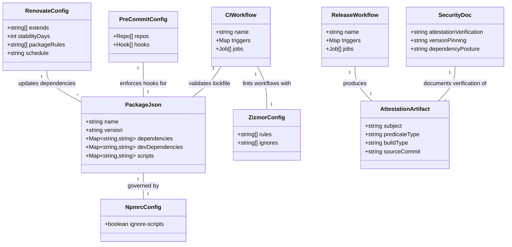

# SBOM Action Security Hardening, Attestation, and Release Packaging

## Requirements

Harden an open-source GitHub Action for safe third-party consumption by establishing supply chain security controls: pin all dependencies to exact versions with install-script prevention, add build attestation proving provenance on every release, configure automated vulnerability monitoring with adoption delay, lint workflow files for security issues with zizmor, enforce local development standards via pre-commit hooks, and provide consumer-facing verification documentation — all without modifying the action's runtime behaviour or exceeding a 5MB bundle size.

## Entities



## Approach

1. **Dependency Hardening**:
   - Pin all production and dev dependency versions to exact (strip `^`/`~` prefixes)
   - Add `.npmrc` with `ignore-scripts=true` to block postinstall attack vectors
   - Regenerate `package-lock.json` with exact versions via `npm install`
   - Verify bundle still builds and tests pass after pinning

2. **CI Pipeline (PR Validation)**:
   - GitHub Actions workflow triggered on pull_request to main
   - Steps: checkout → setup Node (pinned version) → `npm ci` (lockfile integrity) → lint → test → build → verify dist freshness
   - Dependency review step using `actions/dependency-review-action` to block PRs adding vulnerable deps
   - All action refs pinned to full SHAs

3. **Release Pipeline (Tag-triggered)**:
   - Triggered on `v*` tag push
   - Steps: checkout → setup Node → `npm ci` → build → verify no secrets in dist → create GitHub Release → attest build provenance
   - Uses `actions/attest-build-provenance` for SLSA Level 2 attestation
   - Uploads `dist/` as release artifact for independent verification

4. **Automated Dependency Updates (Renovate)**:
   - Configure `renovate.json` with `stabilityDays: 3`
   - Manage both npm dependencies and GitHub Actions SHA pins
   - Group minor/patch updates, separate major updates
   - CI validates all Renovate PRs automatically

5. **Pre-commit Hooks**:
   - Configure `.pre-commit-config.yaml` with hooks for lint, format, and build verification
   - Include zizmor as a pre-commit hook to catch workflow security issues locally before push
   - Ensures contributors run checks locally, reducing CI feedback loop

6. **Workflow Security Linting (zizmor)**:
   - Run zizmor in CI to lint `.github/workflows/*.yml` for security issues
   - Detects: injection vulnerabilities, excessive permissions, unpinned actions, dangerous defaults
   - Also available as pre-commit hook for local development

7. **Security Documentation**:
   - SECURITY.md with attestation verification instructions (`gh attestation verify`)
   - Version pinning guidance (SHA-based refs)
   - Dependency posture overview (3 direct deps, bundled via ncc)

## Structure

### File Layout
1. `.npmrc` — npm security configuration (ignore-scripts)
2. `.pre-commit-config.yaml` — pre-commit hook definitions (lint, format, build, zizmor)
3. `.github/workflows/ci.yml` — PR validation workflow (includes zizmor step)
4. `.github/workflows/release.yml` — tag-triggered release + attestation workflow
5. `renovate.json` — Renovate bot configuration
6. `SECURITY.md` — consumer verification documentation
7. `package.json` — updated with exact version pins

### Dependencies
1. CI workflow depends on: `actions/checkout`, `actions/setup-node`, `actions/dependency-review-action`, zizmor (pip/binary install)
2. Release workflow depends on: `actions/checkout`, `actions/setup-node`, `actions/attest-build-provenance`, `softprops/action-gh-release`
3. Renovate depends on: CI workflow (to validate update PRs)
4. Pre-commit depends on: Python runtime, zizmor, eslint, prettier
5. All action refs pinned to full commit SHAs

### Layered Responsibility
1. **Dependency Layer** (`.npmrc`, `package.json`): version pinning, script prevention
2. **Local Enforcement Layer** (pre-commit): lint, format, build, zizmor — catches issues before push
3. **Validation Layer** (CI workflow): lockfile integrity, lint, test, dist freshness, dependency review, zizmor
4. **Release Layer** (release workflow): build, attest, publish
5. **Monitoring Layer** (Renovate): ongoing vulnerability detection with stability delay
6. **Documentation Layer** (`SECURITY.md`): consumer-facing verification guidance

## Operations

### 1. Create `.npmrc` — Install Script Prevention
1. Responsibility: Block npm lifecycle script execution during dependency installation
2. Content:
   ```ini
   ignore-scripts=true
   ```
3. Location: repository root
4. Rationale: Prevents postinstall/preinstall scripts from executing arbitrary code during `npm ci`

### 2. Update `package.json` — Pin Exact Versions
1. Responsibility: Remove semver range prefixes from all dependency versions
2. Changes:
   - `dependencies`: strip `^` from all 3 entries (`@actions/core`, `@actions/github`, `@actions/http-client`)
   - `devDependencies`: strip `^` from all entries
3. Method: Replace `"^X.Y.Z"` with `"X.Y.Z"` for every dependency
4. Post-update: run `npm install` to regenerate lockfile with exact resolutions, then `npm run build` to verify bundle

### 3. Create `.pre-commit-config.yaml` — Local Development Hooks
1. Responsibility: Enforce code quality and workflow security checks locally before push
2. Content:
   ```yaml
   repos:
     - repo: local
       hooks:
         - id: lint
           name: eslint + prettier
           entry: npm run lint
           language: system
           pass_filenames: false
           files: '^src/.*\.ts$'
         - id: test
           name: jest
           entry: npm test
           language: system
           pass_filenames: false
           files: '^src/.*\.ts$'
         - id: build
           name: ncc build
           entry: npm run build
           language: system
           pass_filenames: false
           files: '^(src/|package).*'
     - repo: https://github.com/woodruffw/zizmor-pre-commit
       rev: v1.4.1
       hooks:
         - id: zizmor
   ```
3. Key behaviours:
   - `lint` hook runs eslint + prettier on staged TypeScript files
   - `test` hook runs jest when source files change
   - `build` hook rebuilds dist when source or package files change
   - `zizmor` hook lints `.github/workflows/` for security issues
4. Rationale: Catches lint failures, test regressions, stale dist, and workflow security issues before push — reduces CI feedback loop

### 4. Create `.github/workflows/ci.yml` — PR Validation
1. Responsibility: Validate PRs maintain code quality, lockfile integrity, dist freshness, and workflow security
2. Trigger: `pull_request` targeting `main`
3. Permissions: `contents: read`
4. Jobs:
   - **validate**:
     - `actions/checkout@<SHA>` — checkout PR code
     - `actions/setup-node@<SHA>` — Node 20, cache npm
     - `npm ci` — install with lockfile enforcement (fails if out of sync)
     - `npm run lint` — eslint + prettier
     - `npm test` — jest
     - `npm run build` — ncc compile
     - Compare `dist/` against committed version — fail if diverged (ensures contributors rebuild)
   - **dependency-review**:
     - `actions/dependency-review-action@<SHA>` — block PRs adding known-vulnerable dependencies
   - **zizmor**:
     - Install zizmor (`pip install zizmor` or use binary)
     - Run `zizmor .github/workflows/` — lint all workflows for security issues
     - Fails on: injection vulnerabilities, excessive permissions, unpinned actions, dangerous defaults
5. Constraints:
   - All action uses pinned to full SHAs (40-char hex)
   - Node version pinned to specific LTS (e.g., `20.x`)
   - `dist/` check only runs when `src/` or `package*.json` changed (path filter)
   - zizmor runs on all PRs that modify `.github/workflows/`

### 5. Create `.github/workflows/release.yml` — Release + Attestation
1. Responsibility: Build, verify, attest, and publish releases on tag push
2. Trigger: `push` with tags matching `v*`
3. Permissions: `contents: write`, `id-token: write`, `attestations: write`
4. Jobs:
   - **release**:
     - `actions/checkout@<SHA>` — checkout tagged commit
     - `actions/setup-node@<SHA>` — Node 20, cache npm
     - `npm ci` — clean install from lockfile
     - `npm run build` — produce fresh `dist/index.js`
     - Verify no secrets in dist: grep for common secret patterns (API keys, tokens, internal URLs) — fail if found
     - Verify bundle size <5MB — fail if exceeded
     - `actions/attest-build-provenance@<SHA>` — generate attestation binding `dist/index.js` to source commit
     - `softprops/action-gh-release@<SHA>` — create GitHub Release with dist artifact attached
5. Constraints:
   - Must NOT run on PRs or forks (only on tag push to main repo)
   - `id-token: write` permission required for OIDC-based attestation
   - Tag must not be reused (attestation is commit-bound)

### 6. Create `renovate.json` — Automated Dependency Management
1. Responsibility: Monitor for vulnerable dependencies, delay adoption of new versions by 3 days
2. Content:
   ```json
   {
     "$schema": "https://docs.renovatebot.com/renovate-schema.json",
     "extends": ["config:base"],
     "stabilityDays": 3,
     "packageRules": [
       {
         "matchManagers": ["npm"],
         "rangeStrategy": "pin"
       },
       {
         "matchManagers": ["github-actions"],
         "pinDigests": true
       },
       {
         "matchUpdateTypes": ["minor", "patch"],
         "groupName": "minor-patch-updates",
         "automerge": false
       }
     ],
     "postUpdateOptions": ["npmDedupe"]
   }
   ```
3. Key behaviours:
   - `stabilityDays: 3` — waits 3 days before raising PR for new version
   - `pinDigests: true` for github-actions — keeps action refs as full SHAs
   - `rangeStrategy: "pin"` — ensures updates produce exact versions
   - `postUpdateOptions: ["npmDedupe"]` — optimises lockfile on update

### 7. Create `SECURITY.md` — Consumer Verification Documentation
1. Responsibility: Guide third-party consumers on verifying action integrity and pinning securely
2. Sections:
   - **Verifying Attestation**: Instructions to run `gh attestation verify` on a release artifact
   - **Pinning to a Verified Release**: How to reference action by SHA rather than tag (e.g., `uses: org/action@<commit-sha>`)
   - **Dependency Posture**: 3 direct production dependencies (all GitHub-maintained `@actions/*`), bundled via ncc, no node_modules shipped
   - **Supply Chain Controls**: exact pinning, ignore-scripts, Renovate with stability delay, dependency review on PRs
3. Tone: concise, actionable, aimed at enterprise security reviewers

### 8. Verify Final State
1. Run full test suite: `npm test`
2. Run full build: `npm run build`
3. Check bundle size: `wc -c dist/index.js` (must be <5MB)
4. Grep dist for secret patterns: no matches expected
5. Run zizmor: `zizmor .github/workflows/` — must pass with no findings
6. Run pre-commit: `pre-commit run --all-files` — must pass
7. Validate CI workflow syntax: `actionlint .github/workflows/*.yml` (if available)

## Norms

1. **Action Reference Pinning**: All `uses:` references in workflow files must use full 40-character commit SHAs, never tags or branch refs. Renovate manages updates.
2. **Version Pinning**: All entries in `dependencies` and `devDependencies` must use exact versions (no `^`, `~`, `>=`, `*`). Renovate raises PRs for updates.
3. **Node Version**: Pin to `20.x` in all CI workflows using `actions/setup-node`. Match `runs.using: "node20"` in `action.yml`.
4. **Workflow Permissions**: Use least-privilege `permissions` block in every workflow. Only release workflow gets `id-token: write`.
5. **No Secrets in Artifacts**: Never embed environment variables, config files, or `.env` in the ncc build. The `dist/` directory contains only compiled JS, source map, and license file.
6. **Lockfile Committed**: `package-lock.json` is always committed. CI uses `npm ci` (not `npm install`) to enforce lockfile integrity.
7. **`.npmrc` Committed**: `ignore-scripts=true` is repository-level policy, committed to source control.
8. **Tag Immutability**: Once a version tag is pushed and attested, it must never be deleted or force-pushed. Create a new version instead.
9. **Dist Freshness**: PRs modifying source code or dependencies must include a rebuilt `dist/`. CI verifies this automatically.
10. **Pre-commit Hooks**: `.pre-commit-config.yaml` is committed to repo. Contributors should run `pre-commit install` after cloning. CI does not depend on pre-commit — it runs checks directly.
11. **Zizmor Workflow Linting**: All workflow files must pass zizmor with zero findings before merge. CI enforces this on PRs modifying `.github/workflows/`.

## Safeguards

1. **Dependency Count Constraint**: `package.json` must not exceed 5 direct production dependencies. CI or review process should flag additions beyond this threshold.
2. **Bundle Size Constraint**: `dist/index.js` must remain under 5,242,880 bytes (5MB). Release workflow fails if exceeded.
3. **No Runtime Performance Impact**: All security measures are build/CI-time only. Zero runtime additions — no new imports, no new network calls, no startup overhead in the action itself.
4. **Lockfile Sync Enforcement**: CI must fail if `package-lock.json` is out of sync with `package.json`. Achieved via `npm ci` which exits non-zero on mismatch.
5. **Attestation Required for Release**: Release workflow cannot publish a GitHub Release without successfully generating an artifact attestation. Attestation step must precede or gate the release step.
6. **Fork Safety**: CI workflow must run on fork PRs without requiring `id-token: write` or repository secrets. Attestation and release workflows only run on the main repository.
7. **Secret Pattern Scanning**: Release workflow must grep `dist/index.js` for common secret patterns (`AKIA`, `ghp_`, `ghs_`, `-----BEGIN`, hardcoded URLs matching internal domains) and fail if any match.
8. **Stability Delay**: Renovate must not raise PRs for package versions younger than 3 days (`stabilityDays: 3`). This is configuration-enforced, not CI-enforced.
9. **Script Execution Prevention**: `.npmrc` with `ignore-scripts=true` must be present and committed. CI installs via `npm ci` which respects this config. Removal of `.npmrc` or this setting should be caught in code review.
10. **Workflow Permission Minimality**: No workflow may request `permissions` beyond what its steps require. `id-token: write` is restricted to the release workflow only.
11. **Zizmor Clean Workflows**: All committed workflow files must produce zero findings from zizmor. CI blocks merge on any finding. This catches injection vulnerabilities, excessive permissions, and unpinned actions.
12. **Pre-commit Optional for Contributors**: Pre-commit hooks are provided for convenience but not enforced server-side. CI runs the same checks independently — contributors who skip pre-commit still get feedback from CI.
