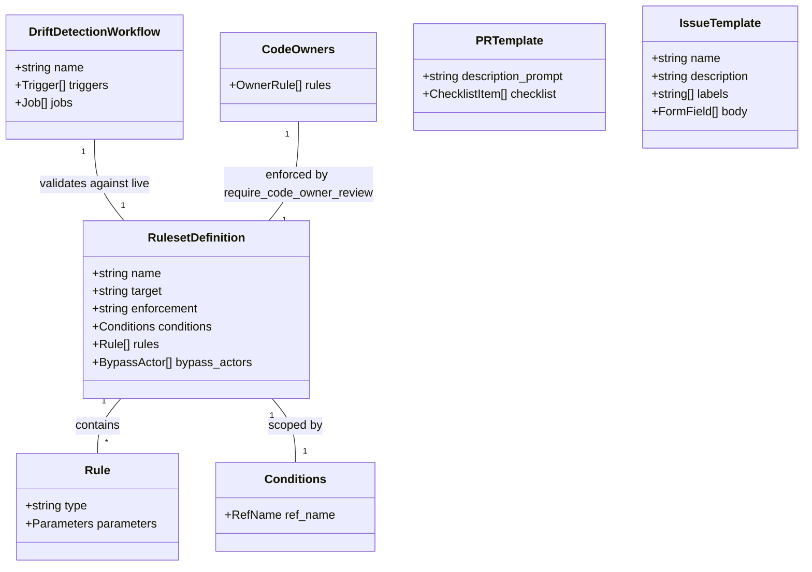

# Repository Governance Configuration

## Requirements

Codify repository governance for an open-source GitHub Action so that branch protection, code ownership, PR quality standards, and issue triage structure are enforced via committed configuration — using GitHub Rulesets (applied via `gh api`, drift-detected by CI) and native GitHub features (CODEOWNERS, templates). No external apps, no admin PATs in CI.

## Entities



## Approach

1. **Rulesets as Code**:
   - Commit ruleset definition as `.github/rulesets/main.json`
   - Maintainer applies to repo via `gh api /repos/{owner}/{repo}/rulesets -X POST --input .github/rulesets/main.json`
   - Updates via `gh api /repos/{owner}/{repo}/rulesets/{id} -X PUT --input .github/rulesets/main.json`
   - No admin PAT stored anywhere — uses maintainer's authenticated `gh` CLI session

2. **Drift Detection**:
   - CI workflow fetches live rulesets via `gh api` (read-only `GITHUB_TOKEN`)
   - Normalises and compares against committed JSON by ruleset name
   - Fails with actionable commands showing how to fix (apply committed → live, or sync live → committed)
   - Triggers: PRs touching `.github/rulesets/`, weekly schedule, manual dispatch

3. **Native GitHub Features (zero-config)**:
   - `.github/CODEOWNERS` — auto-assigns `@co-cddo/octo-observability` as reviewers
   - `.github/pull_request_template.md` — author checklist
   - `.github/ISSUE_TEMPLATE/*.yml` — YAML forms for bugs and features
   - `.github/ISSUE_TEMPLATE/config.yml` — disable blank issues

## Structure

### File Layout
1. `.github/rulesets/main.json` — ruleset definition (source of truth)
2. `.github/workflows/ruleset-drift.yml` — drift detection workflow
3. `.github/CODEOWNERS` — code ownership
4. `.github/pull_request_template.md` — PR checklist
5. `.github/ISSUE_TEMPLATE/bug_report.yml` — bug report form
6. `.github/ISSUE_TEMPLATE/feature_request.yml` — feature request form
7. `.github/ISSUE_TEMPLATE/config.yml` — template chooser config

### Dependencies
1. Drift detection workflow depends on: committed ruleset JSON + GitHub API read access
2. Ruleset `require_code_owner_review` depends on: CODEOWNERS file existing
3. Ruleset `required_status_checks` depends on: CI workflow job names (`validate`, `dependency-review`, `zizmor`)
4. All files are otherwise independent (no cross-file build dependencies)

### Layered Responsibility
1. **Protection Layer** (ruleset JSON): reviews, status checks, force-push/deletion prevention, linear history
2. **Verification Layer** (drift detection workflow): ensures live state matches committed config
3. **Ownership Layer** (CODEOWNERS): reviewer auto-assignment
4. **Contribution Layer** (PR template, issue templates): quality standards for contributors

## Operations

### 1. Create `.github/rulesets/main.json` — Ruleset Definition
1. Responsibility: Define branch protection rules for `main` as committed source of truth
2. Content:
   ```json
   {
     "name": "main-branch-protection",
     "target": "branch",
     "enforcement": "active",
     "conditions": {
       "ref_name": {
         "include": ["refs/heads/main"],
         "exclude": []
       }
     },
     "bypass_actors": [],
     "rules": [
       {
         "type": "deletion"
       },
       {
         "type": "non_fast_forward"
       },
       {
         "type": "required_linear_history"
       },
       {
         "type": "pull_request",
         "parameters": {
           "required_approving_review_count": 1,
           "dismiss_stale_reviews_on_push": true,
           "require_code_owner_review": true,
           "require_last_push_approval": false,
           "required_review_thread_resolution": false
         }
       },
       {
         "type": "required_status_checks",
         "parameters": {
           "strict_required_status_checks_policy": true,
           "required_status_checks": [
             {
               "context": "validate",
               "integration_id": null
             },
             {
               "context": "dependency-review",
               "integration_id": null
             },
             {
               "context": "zizmor",
               "integration_id": null
             }
           ]
         }
       }
     ]
   }
   ```
3. Application instructions (documented in file or README):
   ```bash
   # First-time apply
   gh api /repos/co-cddo/submit-sbom-action/rulesets -X POST --input .github/rulesets/main.json

   # Update existing
   RULESET_ID=$(gh api /repos/co-cddo/submit-sbom-action/rulesets --jq '.[] | select(.name=="main-branch-protection") | .id')
   gh api /repos/co-cddo/submit-sbom-action/rulesets/$RULESET_ID -X PUT --input .github/rulesets/main.json
   ```

### 2. Create `.github/workflows/ruleset-drift.yml` — Drift Detection
1. Responsibility: Detect when live rulesets diverge from committed JSON
2. Triggers:
   - `pull_request` on `main` with path filter `.github/rulesets/**`
   - `schedule`: weekly (Monday 08:23 UTC)
   - `workflow_dispatch`: manual
3. Permissions: `contents: read`
4. Logic:
   - Fetch all live rulesets via `gh api /repos/{owner}/{repo}/rulesets`
   - Extract comparable fields: `{name, target, enforcement, conditions, bypass_actors, rules}`
   - For each committed JSON file in `.github/rulesets/`:
     - Find matching live ruleset by `name`
     - If not found: error — "ruleset exists in config but not live, apply it"
     - If found: normalise both (sort keys), diff
     - If diff: error — show diff + commands to fix in either direction
   - Exit 0 if all in sync, exit 1 if any drift

### 3. Create `.github/CODEOWNERS` — Code Ownership
1. Responsibility: Auto-assign reviewers on all PRs
2. Content:
   ```
   * @co-cddo/octo-observability
   ```

### 4. Create `.github/pull_request_template.md` — PR Checklist
1. Responsibility: Ensure PR authors confirm quality standards
2. Content:
   - Description prompt (HTML comment)
   - Checklist:
     - [ ] Tests pass locally (`npm test`)
     - [ ] Linting passes (`npm run lint`)
     - [ ] `dist/` rebuilt if source changed (`npm run build`)
     - [ ] No secrets or internal URLs in committed code
     - [ ] Documentation updated if behaviour changed
     - [ ] Commit messages follow conventional commits format

### 5. Create `.github/ISSUE_TEMPLATE/bug_report.yml` — Bug Report Form
1. Responsibility: Structured bug reports for efficient triage
2. Fields:
   - `name`: Bug Report
   - `description`: Report a bug with the submit-sbom-action
   - `labels`: ["bug"]
   - Body fields:
     - Description (textarea, required)
     - Expected behaviour (textarea, required)
     - Steps to reproduce (textarea, required, yaml render)
     - Action version (input, required)
     - Runner environment (dropdown: ubuntu-latest, ubuntu-22.04, ubuntu-24.04, other)
     - Additional context (textarea, optional)

### 6. Create `.github/ISSUE_TEMPLATE/feature_request.yml` — Feature Request Form
1. Responsibility: Structured feature requests with justification
2. Fields:
   - `name`: Feature Request
   - `description`: Suggest an enhancement to the submit-sbom-action
   - `labels`: ["enhancement"]
   - Body fields:
     - Problem statement (textarea, required)
     - Proposed solution (textarea, required)
     - Alternatives considered (textarea, optional)
     - Additional context (textarea, optional)

### 7. Create `.github/ISSUE_TEMPLATE/config.yml` — Template Chooser
1. Responsibility: Disable blank issues, force template use
2. Content:
   ```yaml
   blank_issues_enabled: false
   ```

### 8. Verify
1. Validate all YAML files for syntax
2. Validate ruleset JSON is valid JSON
3. Confirm status check context names in ruleset match CI workflow job names
4. Confirm CODEOWNERS syntax is valid (no trailing spaces, valid team ref)

## Norms

1. **Ruleset JSON Format**: Pretty-printed, 2-space indent, sorted keys where order doesn't matter. Must be valid input for `gh api --input`.
2. **Status Check Coupling**: Comment in `main.json` or accompanying docs must note that `required_status_checks` contexts must match CI workflow job names exactly. Any CI job rename requires ruleset update.
3. **YAML Style**: 2-space indentation, no trailing whitespace, single newline at EOF.
4. **Template Minimalism**: PR template < 20 lines. Issue forms < 6 fields each. Lengthy templates get ignored.
5. **CODEOWNERS Simplicity**: Team-based only. No individual usernames. Teams survive personnel changes.
6. **Drift Detection Output**: Error messages must include actionable `gh api` commands showing exactly how to fix the drift in either direction.

## Safeguards

1. **No Admin PAT in CI**: Drift detection uses read-only `GITHUB_TOKEN` only. Ruleset application is a manual maintainer action — never automated in CI.
2. **Status Check Name Stability**: Renaming CI workflow jobs without updating ruleset JSON will block all PR merges. Job names are effectively a public API.
3. **Team Must Exist**: `@co-cddo/octo-observability` must exist in the GitHub org. If missing, CODEOWNERS silently fails and no reviewers are auto-assigned.
4. **Blank Issues Disabled**: All issues must use templates. Contributors needing something outside templates must contact maintainers directly.
5. **Bypass Actors Empty**: No one bypasses the ruleset — including admins. Emergency fixes still require a PR (with fast review).
6. **Drift Detection Scope**: Only compares fields defined in committed JSON. Extra fields returned by GitHub API (like `id`, `created_at`, `node_id`) are stripped before comparison to avoid false positives.
7. **Ruleset Not Auto-Applied**: If committed JSON exists but no live ruleset matches, drift detection fails with instructions to apply. This catches "repo cloned but governance not activated" scenarios.
8. **Squash-Only Not in Ruleset**: Merge strategy (squash-only) is a repository setting, not a ruleset rule. It must be configured separately via repo settings UI or API. Drift detection does not cover this.
